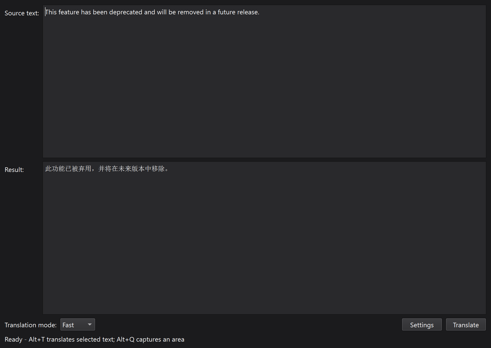

# 本地模型翻译器

中文 | [English](README.en.md)

这是一个尝试性的作品，它无法比拟微信自带的截屏翻译功能，调用本地模型也是一个华而不实的设计，唯一能够拿得出手的只是完全离线和稍长文本的翻译，而这两个功能取决于你的本地模型，很明显，这个作品没有达到我的预期，只能算个小玩具，不过还是欢迎你的使用。

这是这个小作品的最终版本，目前没有继续改进的计划。

程序名为 **LocalLens**，在 Windows 上通过 Ollama 调用本地 AI 模型翻译，用 RapidOCR 识别截图文字。提前装好模型后，就可以离线使用。

## 界面




翻译小窗口使用圆角半透明背景。

## 开始使用

**[下载 Windows 程序包](https://github.com/pleromyst/local-model-translator/releases/latest)**：在 Assets 中下载 `LocalLens-Windows-x64.zip`，打开解压后的 `LocalLens` 文件夹，运行 `LocalLens.exe`。不需要下载下面的 Source code。

1. 准备 64 位 Windows 10 / 11，安装并启动 [Ollama](https://ollama.com/)，下载你想用的模型。
2. 打包版解压整个文件夹后，运行 `LocalLens.exe`，不用安装 Python。GitHub 源码 ZIP 请按下方步骤运行。
3. 在 Settings 里选好模型并保存。运行 `ollama list` 可查看模型名称；默认的 `deepseek-r1:8b` 可以换成自己的模型（请一定保证自己的电脑部署了本地模型！）。Ollama 地址通常保持 `http://127.0.0.1:11434` 即可。

## 翻译

- **选中文字：** 长按左键并滑动选中文本，然后按 `Alt+T`。
- **截图：** 按 `Alt+Q`，框选文字；按 `Esc` 取消。
- **小窗口：** 可以拖动，点 `Copy` 复制译文。
- **语言：** 英文译成中文，中文译成英文；中英混合时，可以保留英文专有名词，并把中文部分翻译成英文。
- **排版：** 截图文字会合成一行，保留识别到的标点。长文本会分段翻译，再按顺序拼起来。

每次翻译独立进行，只显示译文。快捷键和模型可在 Settings 修改。默认翻译后释放模型，下次加载可能需要多等一会儿。

尽量不要与游戏同时运行，你也知道本地模型运行需要占用电脑资源的。

## 启动和退出

打包版首次运行后会添加开始菜单入口，默认登录 Windows 后后台启动，不创建桌面图标。直接用快捷键即可；左键点托盘图标打开主窗口。

关闭主窗口后仍在后台运行，托盘菜单可以彻底退出。需要重开时，按 Win 键搜索 `LocalLens`。Settings 中的 `Sign-in startup` 可以关闭自动启动。移动程序文件夹后，手动运行一次以更新路径。

## 小提醒

- 复杂背景、小字和模糊图片可能识别不准；漏识别的标点不会自动补上。
- 某些全屏游戏、受保护画面可能截不到。管理员程序中选字失败时，可以试试截图。
- 多显示器和不同缩放比例可能有兼容问题。
- 默认不上传正文或截图，不保存翻译历史。模型需要提前下载。
- 设置在 `config/settings.json`；日志在 `logs/locallens.log`，自动滚动，不记录原文和译文。开启 Debug 才会保存调试截图。

## 安装与运行

### 1. 准备本地模型

先安装并打开 [Ollama](https://ollama.com/download/windows)。

打开 PowerShell，输入：

```powershell
ollama list
```

这里会列出你已经安装的模型。如果没有模型，可以先下载一个，例如：

```powershell
ollama pull deepseek-r1:8b
```

这个命令需要联网，也会占用一定的磁盘空间。模型不一定要用这个，按自己的电脑配置选择即可。下载完成后，翻译时可以离线使用。

### 2. 运行翻译器

**如果你下载的是打包好的程序：**

解压整个文件夹，打开里面的 `LocalLens.exe` 即可，不用安装 Python。不要只复制 EXE，旁边的文件也要保留。

**如果你下载的是 GitHub 源码：**

GitHub 的 **Code → Download ZIP** 下载的是源码，里面没有打包好的 EXE，需要按下面的步骤运行。

1. 安装 64 位 Python，安装时勾选 **Add python.exe to PATH**。
2. 在仓库页面点击 **Code → Download ZIP**，下载后解压。
3. 打开解压后的文件夹，找到 `main.py`、`requirements.txt` 和 `build.ps1` 所在的位置。
4. 点击文件资源管理器顶部的地址栏，输入 `powershell`，按回车。
5. 在打开的窗口里依次运行下面三条命令，每条执行完再输入下一条：

```powershell
python -m venv .venv
```

```powershell
.\.venv\Scripts\python.exe -m pip install -r requirements.txt
```

```powershell
.\.venv\Scripts\python.exe main.py
```

第一次安装依赖需要联网，可能要等一会儿。如果某一步报错，先处理报错，不要继续往下执行。

以后再次运行，只需要在同一个文件夹打开 PowerShell，执行：

```powershell
.\.venv\Scripts\python.exe main.py
```

### 3. 选择模型

运行翻译器后，打开 **Settings**：

- Ollama 地址一般保持 `http://127.0.0.1:11434`。
- 选择你已经安装的模型，名称可以用 `ollama list` 查看。
- 点击 **Save** 保存，使用期间保持 Ollama 运行。

然后就可以用了：

- 长按左键并滑动选中文本，按 `Alt+T` 翻译。
- 按 `Alt+Q` 框选截图，按 `Esc` 取消。
- 点击小窗口里的 `Copy` 复制译文。

## 可选：自己打包成 EXE

只想使用程序的话，可以跳过这一节。

先完成上面的源码运行步骤。确认程序能正常运行后，关闭程序，在同一个 PowerShell 窗口里依次执行：

```powershell
.\.venv\Scripts\python.exe -m pip install -r requirements-build.txt
```

```powershell
.\build.ps1
```

打包完成后，打开项目中的 `dist` 文件夹，再进入 `LocalLens`，里面的 `LocalLens.exe` 就是程序。

移动或分享时，请保留整个 `LocalLens` 文件夹，不要只拿走 EXE。对方仍需单独安装 Ollama 和本地模型。

## 许可证

[MIT](LICENSE)，欢迎使用、研究或修改。
