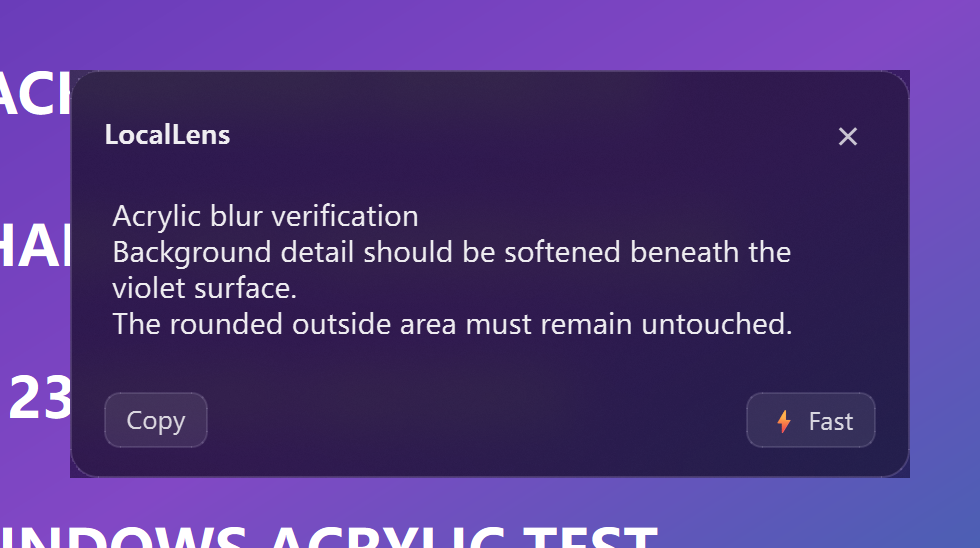

# LocalLens

LocalLens 是一款仅面向 Windows 的全局本地 AI 翻译工具。它使用本机
Ollama 中的 DeepSeek-R1 完成翻译，使用 RapidOCR 与 ONNX Runtime 在本机
识别截图文字；默认不调用云端 AI，也不保存翻译历史。

> 当前状态：公开源代码预览版，尚未完成 v1 最终验收，也不是最终发布版本。当前构建
> 未签名，采用 MIT 许可证。

## 界面截图




## 主要功能

- 在普通软件中选中文字，按 `Alt+T` 获取并翻译，结果显示在鼠标附近的小窗口。
- 对图片、扫描件、视频字幕或不可选择的文字按 `Alt+Q`，框选后执行本地 OCR 和翻译。
- 每次翻译固定使用 Ollama 的 `think=true`；界面只显示最终译文，不显示模型思考内容。
- 每次翻译都是独立请求，不携带历史消息。
- 翻译小窗口使用圆角半透明背景。Acrylic 模糊暂时停用，以避免圆角外残留矩形填色。
- 英文文本默认译为简体中文，中文文本默认译为英文。
- 按当前产品规则，中英文混合文本直接显示原文，不调用本地模型。
- 长文本按段落、换行、句子、空白和字符依次切分，再按原顺序组合结果。
- 支持可修改的翻译/OCR 快捷键、模型、Ollama 地址、GPU 内存释放策略、模型驻留时间和
  GPU 内存释放策略和模型驻留时间。
- 打包版默认在用户登录时以后台模式启动，不创建桌面快捷方式；主窗口不显示，但托盘、
  `Alt+T` 和 `Alt+Q` 可立即使用。
- 单实例运行；关闭主窗口后继续驻留托盘，左键托盘图标重新打开主窗口。

## 系统要求

- 64 位 Windows 10 或 Windows 11；当前打包版已在 Windows 11 上验证。
- 已安装并运行 [Ollama](https://ollama.com/)。
- Ollama 中已存在可用的 DeepSeek-R1 模型。LocalLens 不会自动下载或切换到其他模型。
- 运行所选模型所需的内存或显存；具体需求由模型大小和量化版本决定。
- 使用已打包版本时不需要另外安装 Python。

默认开启“每次翻译完成后释放模型”。LocalLens 会在请求中使用 Ollama 的
[`keep_alive: 0`](https://docs.ollama.com/api/chat)，让模型在响应完成后退出内存或显存，
以减少翻译间歇对游戏的影响。翻译正在执行时模型仍会使用 GPU/CPU；释放后下一次翻译
需要重新加载模型，因此第一次响应会更慢。如果不需要立即释放，可在 Settings 中关闭
该选项并设置空闲驻留时间。

当前开发机器实际检测到的模型为：

| 项目 | 检测结果 |
| --- | --- |
| Ollama 名称 | `deepseek-r1:8b` |
| Architecture | `qwen3` |
| Parameters | `8.2B` |
| Quantization | `Q4_K_M` |
| Context length | `131072` |

模型名称不能只根据示例猜测。请使用 `ollama list` 查看本机真实名称，并在
LocalLens Settings 中选择相同的名称。

## 安装与启动

### 使用 Windows 打包版

1. 安装并启动 Ollama。
2. 在 PowerShell 中执行 `ollama list`，确认 DeepSeek-R1 模型已经存在。
3. 解压完整的 `LocalLens` 目录，不要只复制 `LocalLens.exe`。
4. 运行 `LocalLens.exe`。
5. 在 Settings 中确认 Ollama URL 和模型名称，然后保存。

开发构建没有数字签名，Windows 可能显示来源或安全提醒。发布前应为正式构建增加
可信代码签名；不要关闭系统安全功能来规避提醒。

### Ollama 与 DeepSeek-R1

默认 Ollama 地址为：

```text
http://127.0.0.1:11434
```

LocalLens 仅使用 Ollama HTTP API 的 `/api/tags`、`/api/show` 和 `/api/chat`。
如果尚未安装模型，请由用户自行选择并执行相应的 `ollama pull <模型名>`；程序不会
擅自下载模型，也不会回退到 Qwen-Coder。

### 登录后后台启动

打包版首次正常启动后，会在当前 Windows 用户的登录启动项中登记 LocalLens，并使用
`--background` 参数启动。因此登录后不会弹出主窗口，也不会创建桌面图标；需要界面时
左键点击托盘图标即可打开。翻译和 OCR 快捷键无需打开主窗口。

同时会在“开始”菜单创建或更新 `LocalLens` 入口。即使从托盘菜单完全退出，也可以按
Win 键搜索 `LocalLens` 重新启动，而无需使用桌面图标。

可在 Settings 的 `Sign-in startup` 中关闭此功能；关闭后会移除当前用户的 LocalLens
登录启动项。开发环境运行 `main.py` 不会写入 Windows 启动项。若移动了完整的便携版目录，
请手动运行一次新的 `LocalLens.exe`，让它更新启动路径。

## 使用方法

### 可选择文字：Alt+T

1. 在记事本、浏览器、VS Code、Word 或其他普通程序中选中文字。
2. 按 `Alt+T`。
3. LocalLens 等待按键释放后模拟复制，在鼠标附近显示翻译小窗口。
4. 可复制译文。

LocalLens 会尽量完整保存并安全恢复剪贴板的文本、HTML、URL/文件列表、图片像素和
Qt 可见的原始 MIME 数据。如果翻译过程中用户复制了新内容，则优先保留用户的新剪贴板。

### 不可选择文字：Alt+Q

1. 按 `Alt+Q`。
2. 在当前鼠标所在显示器上拖动框选文字区域。
3. OCR 完成后，LocalLens 使用同一小窗口继续翻译并显示结果。
4. 按 `Esc` 可取消框选。

OCR 会过滤低置信度结果，并把识别到的文字片段重排为一行。英文片段之间补充自然
空格，中文片段直接连接；OCR 已识别出的标点会原样保留。

## 已知限制

### OCR 限制

- v1 重点验证英文和简体中文，不承诺所有语言均能正确识别。
- 复杂背景、低分辨率、模糊、倾斜、艺术字体或文字过小时，可能漏字或误识别。
- 文字本身分散排列时会按检测位置重排；它无法可靠推断原作者没有显示出来的语义结构。
- 只有 OCR 实际识别到的标点才能保留，程序不会猜测或补写缺失标点。
- 接近纯黑、纯白、空白或受保护内容的截图会被视为不可用，不继续翻译。

### 管理员权限限制

普通权限的 LocalLens 可能无法向管理员权限程序发送模拟复制操作，这是 Windows UIPI
权限边界。此时 `Alt+T` 会提示未检测到可选择文字；可尝试 `Alt+Q`，或在确有必要并
了解风险时让 LocalLens 与目标程序使用相同权限级别运行。

### 游戏与受保护画面限制

Qt 桌面截图通常适用于桌面、普通窗口、浏览器、视频以及部分窗口化或无边框游戏，
但不保证支持独占全屏、DRM、反作弊或受保护视频画面。这些内容可能返回黑屏、空白或
缺少图像。v1 不使用注入或绕过保护的方式获取画面。

“每次翻译完成后释放模型”只能释放两次请求之间的模型占用，不能消除翻译执行期间的
GPU/CPU 负载。需要完全避免与游戏争用资源时，应在游戏过程中暂停翻译，或改用适合本机
硬件的更小模型。

### 显示器与缩放

已验证单显示器 200% DPI、负坐标和部分比例换算逻辑。多显示器及不同 DPI 混合环境
已有代码支持，但仍需要更多真实硬件组合验证，不能视为覆盖所有布局。

## 隐私

- 默认不上传截图、OCR 文字或翻译正文，不调用云端 AI。
- 不包含账号、遥测、分析或自动更新服务。
- 不建立翻译数据库、历史文件、响应缓存或持久聊天记录。
- 每次 Ollama 请求仅包含系统翻译提示和当前原文。
- 快捷翻译小窗口关闭后会释放当前原文，并阻止迟到的后台结果重新显示它。
- 截图默认只保留在内存；只有主动启用 Debug 时才写入 `logs/debug_capture.png`。
- 关闭 Debug 会删除上述调试截图。
- `logs/locallens.log` 仅记录运行状态、耗时、计数、HTTP 状态和安全的异常类型，不记录
  原文、OCR 全文、译文、截图或模型 thinking 内容。
- 日志单文件上限为 2 MiB，最多保留三个滚动备份。

## 配置与运行文件

- `config/settings.json`：用户配置。
- `logs/locallens.log`：隐私安全的滚动诊断日志。
- `logs/debug_capture.png`：仅在 Debug 开启并执行截图识别后存在。

如果配置损坏，LocalLens 会保留带时间戳的 `.corrupt-*` 备份并恢复默认配置。

## 开发

建议使用项目自己的虚拟环境，不依赖 PowerShell 激活脚本：

```powershell
python -m venv .venv
.\.venv\Scripts\python.exe -m pip install --upgrade pip
.\.venv\Scripts\python.exe -m pip install -r requirements.txt
.\.venv\Scripts\python.exe main.py
```

`requirements.txt` 用于安装直接依赖；`requirements-lock.txt` 记录本次已验证的完整、
精确依赖环境。需要复现发布构建时可改为安装锁定文件。

运行自动测试：

```powershell
.\.venv\Scripts\python.exe -m pytest -q
```

主要技术栈：Python 3、PySide6、Requests、RapidOCR、ONNX Runtime、NumPy 和 pytest。
全局快捷键使用 Windows 原生 `RegisterHotKey`，模拟复制使用 `SendInput`。

## Windows 打包

第一版使用 PyInstaller `onedir`，不使用 `onefile`：

```powershell
.\.venv\Scripts\python.exe -m pip install -r requirements-build.txt
.\build.ps1
```

产物位于：

```text
dist\LocalLens\LocalLens.exe
```

移动或分发时必须保留完整的 `dist\LocalLens` 目录。`_internal` 中包含 PySide6 插件、
RapidOCR 模型、ONNX Runtime 与其他运行依赖；可编辑的 `config` 和 `logs` 位于 EXE 同层。

## Roadmap

- 完成 v1 最终验收，包括记事本、浏览器、VS Code、OCR、并发与剪贴板测试。
- 在更多真实多显示器、不同 DPI 与负坐标布局上验证。
- 根据真实黑屏案例评估可选的 `Windows.Graphics.Capture` 后端。
- 发布前增加版本资源、代码签名和可选安装程序。
- 完成透明材质、游戏共存和最终人工验收后发布正式版本。

## License

[MIT](LICENSE)
